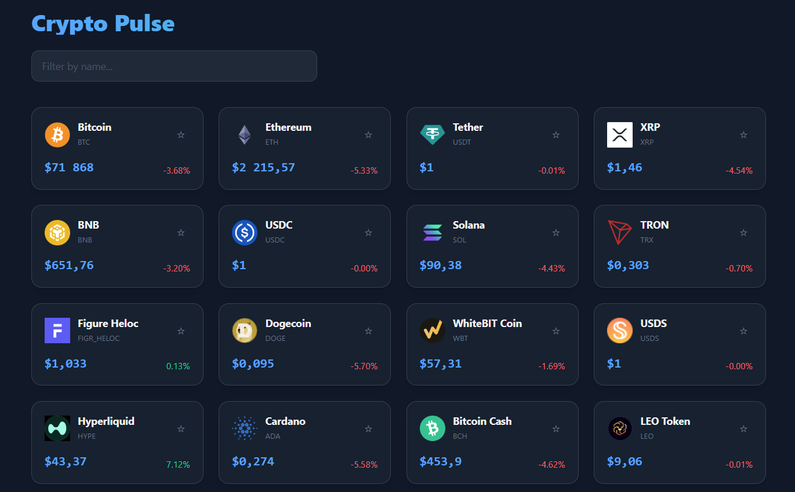
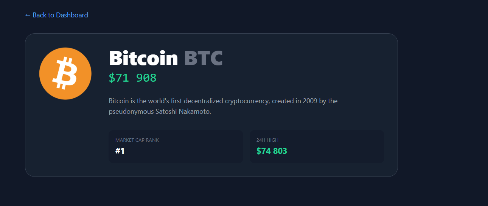

# Crypto Pulse

An interactive dashboard for tracking cryptocurrency prices with filtering, sorting, and real-time analytics.

## Features

- **Real-Time Data**: Fetches live top 50 cryptocurrency market data using the CoinGecko API.
- **Search & Filter**: Quickly find specific coins by name using the search bar.
- **Favorites System**: Bookmark your favorite cryptocurrencies for easy tracking and quick access.
- **Detailed Analytics**: Click on any coin to view in-depth market data, descriptions, market cap rank, and 24-hour highs/lows.
- **Optimized Caching**: Utilizes TanStack React Query for highly efficient caching and auto-refetching every 60 seconds.
- **Responsive & Modern UI**: Built with Tailwind CSS, featuring a sleek dark mode layout, skeleton loaders, and smooth hover effects.

## Tech Stack

- **Framework**: React + Vite (TypeScript)
- **Styling**: Tailwind CSS
- **Routing**: React Router DOM
- **Data Fetching**: Axios & TanStack React Query

## Getting Started

1. Clone the repository
2. Install dependencies:
   ```bash
   npm install
   ```
3. Run the development server:
   ```bash
   npm run dev
   ```

## License
MIT


